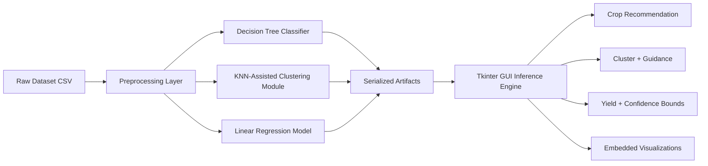

# Integration and Deployment of a Multi-Model Agricultural Intelligence System

This project assembles three required AI paradigms into one executable decision-support platform for agriculture:
- Decision Tree Classification for crop recommendation
- KNN-assisted Clustering pipeline for agro-climatic zone segmentation
- Linear Regression for quantitative yield prediction

The application is deployed as a unified Tkinter GUI that performs sequential inference from the serialized models and displays integrated outputs with in-app visualizations.

## Repository Structure

```text
repository/
├── data/
│   └── yield_df.csv
├── src/
│   ├── preprocessing.py
│   ├── models.py
│   ├── gui.py
│   └── utils.py
├── models/
│   └── (serialized model artifacts)
├── results/
│   └── (metrics, plots, screenshots)
├── requirements.txt
├── LICENSE
└── README.md
```

## System Architecture Diagram



## Data Dictionary and Preprocessing Rationale

Main data file: `data/yield_df.csv`

Features used:
- `Area`: Country/region identifier
- `Item`: Crop category label
- `Year`: Observation year
- `average_rain_fall_mm_per_year`: Mean annual rainfall
- `pesticides_tonnes`: Pesticide usage amount
- `avg_temp`: Mean annual temperature
- `hg/ha_yield`: Crop yield (target for regression)

Preprocessing steps:
1. Removal of unnamed index-like column (`H1`/`Unnamed` fields)
2. Missing value imputation using median strategy for numeric fields
3. Outlier treatment using IQR clipping on numeric features
4. Categorical normalization (strip and unknown handling)
5. Feature scaling for clustering and regression numeric streams
6. One-hot encoding for categorical variables in supervised models

## Algorithmic Rationale

1. Decision Tree Classifier
- Interpretable rule-based crop recommendation
- Feature importance provides agronomic explainability

2. KNN-Assisted Clustering Module
- KMeans identifies homogeneous agro-climatic zones
- KNN inference model maps new user input to nearest learned zone
- Silhouette score validates cluster compactness and separation

3. Linear Regression
- Baseline quantitative predictor for yield
- Supports transparent residual diagnostics and confidence interval reporting

## Quantitative Performance Summary

Run training first to auto-generate metrics in `results/metrics.json`.

Reported metrics:
- Classification: Accuracy, Precision (weighted), Recall (weighted)
- Clustering: Silhouette Score, best cluster count
- Regression: RMSE, MAE, R2, residual standard deviation

## Installation and Execution

1. Create virtual environment and install dependencies

```powershell
python -m venv .venv
.\.venv\Scripts\Activate.ps1
pip install -r requirements.txt
```

2. Train all models and generate artifacts

```powershell
.\.venv\Scripts\python.exe src\models.py
```

3. Launch GUI

```powershell
.\.venv\Scripts\python.exe src\gui.py
```

## Expected Results Outputs

The `results/` folder will contain:
- `metrics.json`
- `feature_importance.png`
- `cluster_scatter.png`
- `residual_plot.png`
- `cleaned_dataset.csv`
- `data_dictionary.csv`
- `preprocessing_metadata.json`

The `models/` folder will contain serialized artifacts for inference reuse.

## Future Work

1. IoT Integration: Real-time sensor streaming for adaptive recommendation updates and edge deployment.
2. Geo-Spatial Expansion: Fuse satellite vegetation indices and weather forecast APIs for multi-horizon yield forecasting.

## Academic Reporting Guidance

Use `report/report_template.md` as a draft skeleton and convert it into IEEE or ACM formatted PDF for LMS submission.
